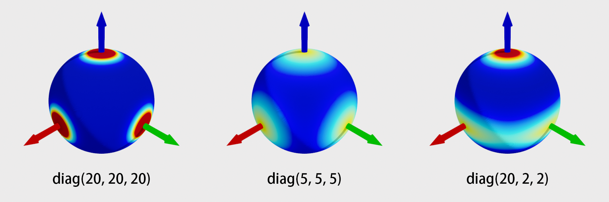

# Visualize distributions on SO(3) manifold


<p align="center">
Visualization of matrix Fisher distribution
</p>

We implement the visualization via color coding on a 2-sphere. This method was proposed in [1] and first used in [2].
However, we did not find the released code on this visualization.

This implementation was used in [3] ([Project page](https://pku-epic.github.io/RotationLaplace/)). Please consider citing [3] if you find this implementation helpful.

```bibtex
@article{yin2023laplace,
  title={A Laplace-inspired Distribution on SO(3) for Probabilistic Rotation Estimation},
  author={Yingda Yin, Yang Wang, He Wang and Baoquan Chen},
  journal={International Conference on Learning Representations (ICLR)},
  year={2023}
}
```


[1] Taeyoung Lee. Bayesian attitude estimation with the matrix fisher distribution on so (3). IEEE Transactions on Automatic Control 2018.

[2] David Mohlin et al. Probabilistic orientation estimation with matrix fisher distributions. Advances in Neural Information Processing Systems 2020.

[3] Yingda Yin et al. A Laplace-inspired Distribution on SO(3) for Probabilistic Rotation Estimation. International Conference on Learning Representations 2023.


